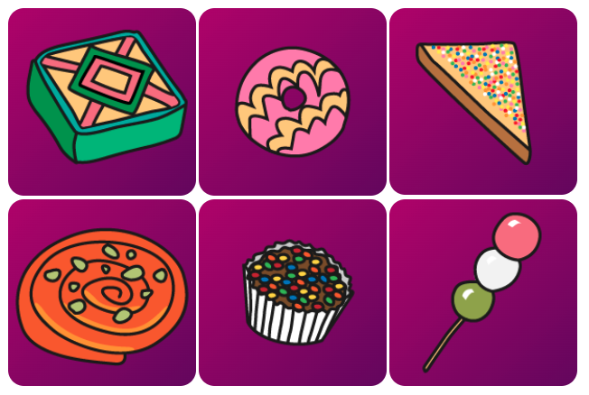

## Introduction

In this project, you will create a set of flip cards with treats from around the world. The cards flip over when you hover over them or tap them. 

**Flip cards** add interactivity to a web page. They also allow you to provide additional information in a small space or hide information that shouldn't be immediately visible. Some common examples of animated flip cards are: revision cards, business cards, social media contact cards, and product cards. 

You will:
+ Use CSS animations to create a **card that flips over** when interacted with
+ Apply a **gradient** background using CSS
+ Add and use a font from **Google Fonts**

--- no-print ---

--- task ---

### Try it

Explore these flip treats webcards. What happens when you hover over a card? 

Can you find the background gradients and fancy font?

<iframe src="https://trinket.io/embed/html/d32996ce0d?outputOnly=true" width="550" height="710" frameborder="0" marginwidth="0" marginheight="0" allowfullscreen></iframe>

--- /task ---

--- /no-print ---

--- print-only ---

--- /print-only ---
