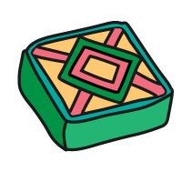

## Create your card

In this step you will create an infocard for a tasty treat with an image, heading, and text.

<iframe src="https://staging-editor.raspberrypi.org/en/embed/viewer/flip-treat-webcards-step-2" width="500" height="400" frameborder="0" marginwidth="0" marginheight="0" allowfullscreen> </iframe>

--- task ---

Open the [Flip treat webcards starter project](https://staging-editor.raspberrypi.org/en/projects/flip-treat-webcards-starter){:target="_blank"}.

--- /task ---

--- task ---

The `<title>` tag within your code is used to display text in the title bar of your web browser. This text should be relevant to your webpage. 
  
You can find the `<title>` in the `<head>` element at the top of your `index.html` file. 

**Change** your title to `Treat flip cards`.

--- code ---
---
language: html
filename: index.html
line_numbers: true
line_number_start: 1
line_highlights: 11
---
<!DOCTYPE html>
<html lang="en">
  <!-- This part is for extra information the browser needs to load the page correctly-->
  <head>
    <meta charset="utf-8" />

    <!-- Don't shrink the page on mobile -->
    <meta name="viewport" content="width=device-width, initial-scale=1.0" />

    <!-- Appears on the web browser tab and search results -->
    <title>Treat flip cards</title>

--- /code ---

--- /task ---

--- task ---

Click on the small triangle next to the `<head>` tag to collapse the `<head>`. 

You can collapse parts of the code you don't need to focus on to make your code easier to read.

--- /task ---
    
--- task ---

Add a `<section>` to the `<main>` part of your page. Give the `<section>` a `wrap` class to make your webpage responsive.

--- code ---
---
language: html
filename: index.html
line_numbers: true
line_number_start: 25
line_highlights: 28-30
---
<body>

    <main>
      <section class="wrap">
        
      </section>

--- /code ---

--- /task ---

**Graphic designers** are people who create engaging physical or digital visual content. Some examples of graphic design work include company logos, product packaging, and website banner design. Our graphic designer Kate has made some images of treats from around the world for you to use in your project. 

The `
` element is used to group other elements. The `
` element is used when there isn't a more appropriate tag, such as `<section>` and `<blockquote>`.

--- task ---

Create a `
` that contains an image. The first image is `LapisSarawak02.png`, a sweet treat from Malaysia.

--- code ---
---
language: html
filename: index.html
line_numbers: true
line_number_start: 28
line_highlights: 29-31
---

<section class="wrap">
  

    
  

</section>

--- /code ---

--- /task ---

--- task ---

Add another `
` with a heading and short paragraph about Lapis Sarawak:

Heading: `Lapis Sarawak` 
Paragraph: `A cake baked in layers to make colourful patterns.`

--- code ---
---
language: html
filename: index.html
line_numbers: true
line_number_start: 29
line_highlights: 33-36
---
         
<section class="wrap">
        

          
        

        

          <h2>Lapis Sarawak</h2>
          
A cake baked in layers to make colourful patterns.

        

</section>
        
--- /code ---

--- /task ---

--- task ---

**Test:** View your webpage. You should be able to see an image of a Lapis Sarawak and your text that describes the image.

<iframe src="https://staging-editor.raspberrypi.org/en/embed/viewer/flip-treat-webcards-step-2" width="500" height="450" frameborder="0" marginwidth="0" marginheight="0" allowfullscreen> </iframe>

--- /task ---
