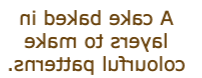

## Flip your card

In this step you will make a card flippable with content on the front and back. 

<iframe src="https://trinket.io/embed/html/0865813006?outputOnly=true" width="400" height="300" frameborder="0" marginwidth="0" marginheight="0" allowfullscreen></iframe>

You will use `

` tags to structure your code and seperate the main parts of the card:

+ The flip card
  + The viewable content
    + The front card face
    + The back card face

--- task ---

The `card` class has been created for you in `style.css` and sets the width, height and border of the card. 

Add `

` tags around your current Lapis Sarawak code with the CSS class `card`. 

--- code ---
---
language: html
filename: index.html
line_numbers: true
line_number_start: 27
line_highlights: 29, 37
---
    <main>
       <section class="wrap">
         

            

              
            

            

              <h2>Lapis Sarawak</h2>
              
A cake baked in layers to make colourful patterns.

            

          

      </section>

--- /code ---

--- /task ---

--- task ---

The `card-content` class has been created for you in `style.css` and controls the timing, perspective and 3d effect of the flip. 

Add another set of `

` tags inside your card with the CSS class `card-content`. 

--- code ---
---
language: html
filename: index.html
line_numbers: true
line_number_start: 27
line_highlights: 30, 38
---
    <main>
       <section class="wrap">
         

            

              

                
              

              

                <h2>Lapis Sarawak</h2>
                
A cake baked in layers to make colourful patterns.

              

            

        

      </section>

--- /code ---

--- /task ---

--- task ---

**Test:** Hover over (or tap) the card on your webpage. The content should flip over. 

What do you notice about the content?

--- /task ---

--- task ---

Add the `card-face` class to the `
` tag around the image. The `card-face` class tells the elements within it to hide when they are flipped to the back. 
 
--- code ---
---
language: html
filename: index.html
line_numbers: true
line_number_start: 27
line_highlights: 31
---
    <main>
            <section class="wrap">
              

                

                  

                    
                  

                  

                   <h2>Lapis Sarawak</h2>
                   
A cake baked in layers to make colourful patterns.

                  

                 

               

           </section> 

--- /code ---

--- /task ---

--- task ---

**Test:** Hover over (or tap) the card on your webpage. The image and text will appear on top of each other but the image should hide when the card is flipped. 

--- /task ---

--- task ---

Add the `card-face` class to the `
` tag around the heading and paragraph so they also hide when they are flipped to the back.
 
--- code ---
---
language: html
filename: index.html
line_numbers: true
line_number_start: 27
line_highlights: 34
---
    <main>
            <section class="wrap">
              

                

                  

                    
                  

                  

                   <h2>Lapis Sarawak</h2>
                   
A cake baked in layers to make colourful patterns.

                  

                 

               

           </section> 

--- /code ---

--- /task ---

--- task ---

**Test:** Hover over (or tap) the card on your webpage. Both the image and the text now appear on the front of the card and are both hidden when the card is flipped. 

--- /task ---

Your card needs the text to appear on the back flipped face and not on the front. Earlier when the text did appear on the back it was flipped so could only be read backwards from right to left. We can solve both of these things with one piece of code. 

--- task ---

Add the `flipme` class to the `
` tag around the heading and paragraph. This will rotate the text 180 degrees so it is flipped to the back face and now can be read correctly. 
 
--- code ---
---
language: html
filename: index.html
line_numbers: true
line_number_start: 27
line_highlights: 34
---
    <main>
            <section class="wrap">
              

                

                  

                    
                  

                  

                   <h2>Lapis Sarawak</h2>
                   
A cake baked in layers to make colourful patterns.

                  

                 

               

           </section> 

--- /code ---

--- /task ---

--- task ---

**Test:** Hover over (or tap) the card on your webpage to see your flip card.

<iframe src="https://trinket.io/embed/html/0865813006?outputOnly=true" width="400" height="300" frameborder="0" marginwidth="0" marginheight="0" allowfullscreen></iframe>

--- /task ---

--- save ---