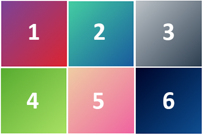
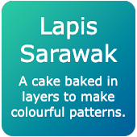

## Style your card

In this step you will add colour gradients and rounded corners to your card. You will also align the text so that it appears in the centre of the card. 

<iframe src="https://staging-editor.raspberrypi.org/en/embed/viewer/flip-treat-webcards-step_4" width="500" height="400" frameborder="0" marginwidth="0" marginheight="0" allowfullscreen> </iframe>

**Colour gradients** are a gradual change from one colour to another. To process how to display a smooth colour gradient, computers work out the positions and colour shades needed to go from the starting colour through to the end colour. 

Gradients are used to make your card attract the viewer's attention. 

--- task ---

Add the `gradient1` class to the `
` that displays the image. 

The `gradient1` class uses a linear gradient that transitions diagonally from one colour at the top to another colour at the bottom. 

--- code ---
---
language: html
filename: index.html
line_numbers: true
line_number_start: 28
line_highlights: 31
---
    <section class="wrap">
        

          

            

              
            

            

              <h2>Lapis Sarawak</h2>
              
A cake baked in layers to make colourful patterns.

            

          

        

    </section>

--- /code ---

--- /task ---

--- task ---

Add the `gradient2` class to the `
` that displays the heading and paragraph. 

The `gradient2` class uses a linear gradient that transitions diagonally from one colour at the top to another colour at the bottom right. 

--- code ---
---
language: html
filename: index.html
line_numbers: true
line_number_start: 28
line_highlights: 35
---
    <section class="wrap">
        

          

            

              
            

            

              <h2>Lapis Sarawak</h2>
              
A cake baked in layers to make colourful patterns.

            

          

        

    </section>

--- /code ---

--- /task ---

--- task ---

**Test:** Hover over (or tap) the card in your webpage to see that both gradients have been added. 

<iframe src="https://trinket.io/embed/html/8d08027bea?outputOnly=true" width="500" height="400" frameborder="0" marginwidth="0" marginheight="0" allowfullscreen></iframe>

--- /task ---

--- task ---

Click on the `default.css` file and find the colour palette near the top of the page.

**Choose:** Colour gradients use variables from the colour palette. Choose the gradients you like the best from these options:

1.  #7b4397 → #dc2430
2.  #43cea2 → #185a9d
3.  #bdc3c7 → #2c3e50
4.  #56ab2f → #a8e063
5.  #eecda3 → #ef629f
6.  #000428 → #004e92

**Update** the variables to see the front and back card faces in your new gradient:

 + The front card face uses `secondary` and `detail` variables
 + The back card face uses `tertiary` and `detail2` variables 

**Tip:** You might also need to change `onsecondary` and `ontertiary` colours so your text can be read on the new colour gradients. 

--- code ---
---
language: css
filename: default.css
line_numbers: true
line_number_start: 1
line_highlights: 5-6, 9-10, 12-13
---
  /* Set up colour palette and fonts using variables */

:root {
  --primary: #ffffff;
  --secondary: #aa076b;
  --tertiary: #43cea2; 
  --page: #ffffff;
  --onprimary: #664300;
  --onsecondary: #664300;
  --ontertiary: #ffffff;
  --onpage: #000000;
  --detail: #ffb88c;
  --detail2: #185a9d;

--- /code ---

--- /task ---

--- task ---

Find the `gradient1` and `gradient2` classes.

**Choose:** Update the gradient to the direction you like best. Try `top`, `right`, or `bottom left`.

--- code ---
---
language: css
filename: style.css
line_numbers: true
line_number_start: 243
line_highlights: 245, 254
---
  .gradient1 {
  background-image: linear-gradient(
    to bottom,
    var(--secondary),
    var(--detail)
  );
  color: var(--onsecondary);
}

.gradient2 {
  background-image: linear-gradient(
    to bottom right,
    var(--tertiary),
    var(--detail2)
  );
  color: var(--ontertiary);
}

--- /code ---

--- /task ---

--- task ---

Click on `index.html`. Add the `rounded` class to both of your card faces to add rounded corners to your card. 

--- code ---
---
language: html
filename: index.html
line_numbers: true
line_number_start: 28
line_highlights: 31, 35
---
    <section class="wrap">
        

          

            

              
            

            

              <h2>Lapis Sarawak</h2>
              
A cake baked in layers to make colourful patterns.

            

          

        

    </section>

--- /code ---

--- /task ---

--- task ---

**Test:** Hover over (or tap) the card in your webpage to check that both sides of the card have rounded corners. 

<iframe src="https://trinket.io/embed/html/8d3a67a764?outputOnly=true" width="500" height="400" frameborder="0" marginwidth="0" marginheight="0" allowfullscreen></iframe>

--- /task ---

--- task ---

The text on the card is aligned vertically to the top of the card. 

Add the `ycenter` class to align the text in the centre along the `y` axis. 

--- code ---
---
language: html
filename: index.html
line_numbers: true
line_number_start: 28
line_highlights: 35
---
    <section class="wrap">
        

          

            

              
            

            

              <h2>Lapis Sarawak</h2>
              
A cake baked in layers to make colourful patterns.

            

          

        

    </section>

--- /code ---

--- /task ---

--- task ---

**Test:** Hover over (or tap) the card in your webpage to check that the text on the second face is aligned in the centre of the `y` axis. 

<iframe src="https://trinket.io/embed/html/d885c71711?outputOnly=true" width="500" height="400" frameborder="0" marginwidth="0" marginheight="0" allowfullscreen></iframe>

--- /task ---

--- task ---

Use the `shadow` class to add a shadow effect to both sides of your card.

--- code ---
---
language: html
filename: index.html
line_numbers: true
line_number_start: 28
line_highlights: 32, 35
---
    <main>
       <section class="wrap">
         

            

              

                
              

              

                <h2>Lapis Sarawak</h2>
                
A cake baked in layers to make colourful patterns.

              

            

        

      </section>

--- /code ---

--- /task ---

--- task ---

**Test:** Hover over (or tap) the card in your webpage to check that the card now has a shadow effect.

<iframe src="https://staging-editor.raspberrypi.org/en/embed/viewer/flip-treat-webcards-step_4" width="500" height="400" frameborder="0" marginwidth="0" marginheight="0" allowfullscreen> </iframe>

--- /task ---

