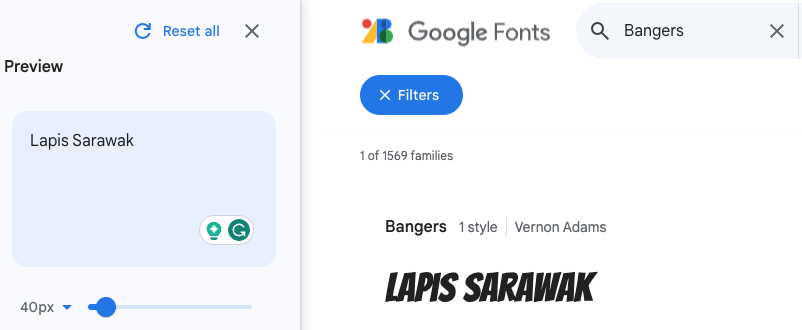

## Choose your font

You are now going to use Google's online font library to import a decorative font into your web page. 

<iframe src="https://trinket.io/embed/html/d6e6ad03dc?outputOnly=true" width="400" height="300" frameborder="0" marginwidth="0" marginheight="0" allowfullscreen></iframe>

**Web designers** need to consider how a website looks and how it reflects the brand of the company, product or person that they are designing for. Standard web safe fonts are recommended for the majority of text on a webpage but when a designer wants to create an impact, a more unique font can be used. Designers can import **web fonts** from an online font library to make their websites stand out.

[[[web-fonts]]]

Google has a free online font library with over 1400 fonts to choose from. The site allows you to browse different fonts using your own sample text to help you find the right one. It then gives you the **HTML** and **CSS** code that you need to **import** the font into your website. 

--- task ---

Open [fonts.google.com](https://fonts.google.com/){:target="_blank"}. It will open in a new tab. 

--- /task ---

--- task ---

Type in some sample text in the **sentence** box. The example uses our treat name `Lapis Sarawack`.

**Note** how the examples below now show your sample text. You can see how your words will look in all of the fonts available. 

--- /task ---

There are many different search options to choose from. You can search by category (fallback font families), language or different font properties. 

--- task ---

Enter the font name `Bangers` into the main search box. 

**Note** that you can now see an example of the Bangers font being applied to the sample text. 

--- /task ---

--- task ---

Click on the Bangers card that has appeared in the search results.

--- /task ---

--- task ---

Click on the `Select this style` link.

**Note** that a pane will pop in from the side that gives you the code that you need.

--- /task ---

--- task ---

Highlight the HTML text and right click and select copy (tap and hold) to copy the HTML code.

--- /task ---

--- task ---

Find the comment in your `index.html` document that says `<!-- Import fonts from Google -->`.

Paste the HTML code that you have just copied below the comment.

--- code ---
---
language: html
filename: index.html
line_numbers: true
line_number_start: 15
line_highlights: 16-18
---
  <!-- Import fonts from Google -->
  <link rel="preconnect" href="https://fonts.googleapis.com">
  <link rel="preconnect" href="https://fonts.gstatic.com" crossorigin>
  <link href="https://fonts.googleapis.com/css2?family=Bangers&display=swap" rel="stylesheet">

--- /code ---

--- /task ---

You have now imported the fonts that you need from the Google font library. You now need to add in the correct CSS so that the web browser knows when to use this font. 

--- task ---

Go back to the Google font library webpage and copy the CSS code. You only need the code **after** `font-family: `

--- /task ---

--- task ---

Go to your `style.css` file and find the `header-font` and `title-font` variables. 

**Replace** the current font `Verdana, sans-serif;` with your new one by deleting the text and pressing paste.

--- code ---
---
language: css
filename: style.css
line_numbers: true
line_number_start: 15
line_highlights: 16-17
---
  --body-font: 1.1rem Verdana, sans-serif;
  --header-font: lighter 3rem 'Bangers', cursive;
  --title-font: lighter 2rem 'Bangers', cursive;

--- /code ---

--- /task ---

--- task ---

**Test:** Hover over (or tap) your flip card in the preview pane. You should see your new font applied to the heading of the back of the card.

<iframe src="https://trinket.io/embed/html/d6e6ad03dc?outputOnly=true" width="400" height="300" frameborder="0" marginwidth="0" marginheight="0" allowfullscreen></iframe>

--- /task ---

--- task ---

**Choose:** You can choose your own font by going back to [fonts.google.com](https://fonts.google.com/){:target="_blank"}.

**Remove** the Bangers style in Google Fonts by click on `remove this style` before selecting your new font. 

--- /task ---

