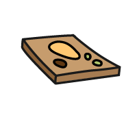
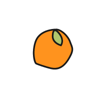
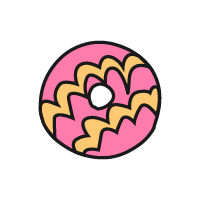

## Upgrade your project

If you have time, you can add more cards to your project. 

--- task ---

Customise the styling of your card in `style.css`. You could:

+ Alter the animation settings in the `card-content` class:
    + Change the seconds in the `transition: transform 1s;` line of code.
    + Change the persective size in the `perspective: 60rem;` line of code.

+ Amend the colour gradient 
    + Choose new colours for `secondary` and `detail` variables to change the front card face
    + Choose new colours for `tertiary` and `detail2` variables to change the back card face
    + Change the gradient direction in the `gradient1` and `gradient2` classes (try `top` or `bottom left`)

+ Import a new fancy font to the `index.html` <head> tag and update the `--title-font` and `--body-font` classes.

--- /task ---

--- task ---

Use your skills from [Anime expressions](http://rpf.io/anime-expressions){:target="_blank"} project and [Top 5 emoji list](http://rpf.io/top-5-emoji-list){:target="_blank"} project to add a header, footer, or quotes to your flip treat webpage.

--- /task ---

--- task ---

To add another card, copy the completed card code below and paste it into `index.html` below your first card:

--- code ---
---
language: html
filename: index.html
---
    <section class="wrap">
        

          

            

              
            

            

              <h2>TreatName</h2>
              
TreatDescription

            

          

        

    </section>

--- /code ---

Replace `ImageName`, `TreatName` and `TreatDescription` with your choosen treats from the list below. 

--- collapse ---

---
title: Bara Brith
---

ImageName: BaraBrith.png
TreatName:
TreatDescription:

--- /collapse ---

--- collapse ---

---
title: Breskvice
---

ImageName: Breskvice01.png or Breskvice02.png
TreatName:
TreatDescription:

--- /collapse ---

--- collapse ---

---
title: Brigadeiro
---

ImageName: Brigadeiro.png
TreatName:
TreatDescription:

--- /collapse ---

--- collapse ---

---
title: Dango
---

ImageName: Dango01.png or Dango02.png
TreatName:
TreatDescription:

--- /collapse ---

--- collapse ---

---
title: DatePalm
---

ImageName: DatePalm01.png or DatePalm02.png
TreatName:
TreatDescription:

--- /collapse ---

--- collapse ---

---
title: Eclair
---

ImageName: Eclair.png
TreatName:
TreatDescription:

--- /collapse ---

--- collapse ---

---
title: Fairy Bread
---

ImageName: FairyBread.png
TreatName:
TreatDescription:

--- /collapse ---

--- collapse ---

---
title: French Fancy
---

ImageName: FrenchFancy.png
TreatName:
TreatDescription:

--- /collapse ---

--- collapse ---

---
title: Halva
---

ImageName: Halva.png
TreatName:
TreatDescription:

--- /collapse ---

--- collapse ---

---
title: Jalebi
---

ImageName: Jalebi.png
TreatName:
TreatDescription:

--- /collapse ---

--- collapse ---

---
title: Knafeh
---

ImageName: Knafeh.png
TreatName:
TreatDescription:

--- /collapse ---

--- collapse ---

---
title: Ladoo
---

ImageName: Ladoo.png
TreatName:
TreatDescription:

--- /collapse ---

--- collapse ---

---
title: Lolly Cake
---

ImageName: LollyCake.png
TreatName:
TreatDescription:

--- /collapse ---

--- collapse ---

---
title: Maejakgwa
---

ImageName: Maejakgwa01.png or Maejakgwa02.png
TreatName:
TreatDescription:

--- /collapse ---

--- collapse ---

---
title: Mandazi
---

ImageName: Mandazi.png
TreatName:
TreatDescription:

--- /collapse ---

--- collapse ---

---
title: Maple Leaf Biscuit
---

ImageName: MapleLeafBiscuit.png
TreatName:
TreatDescription:

--- /collapse ---

--- collapse ---

---
title: Oliebollen
---

ImageName: Oliebollen.png
TreatName:
TreatDescription:

--- /collapse ---

--- collapse ---

---
title: Party Ring
---

ImageName: PartyRing.png
TreatName:
TreatDescription:

--- /collapse ---

--- collapse ---

---
title: Tim Tams
---

ImageName: TimTams.png
TreatName:
TreatDescription:

--- /collapse ---

--- collapse ---

---
title: Zarda
---

ImageName: Zarda.png
TreatName:
TreatDescription:

--- /collapse ---

--- /task ---

<iframe src="https://trinket.io/embed/html/d32996ce0d?outputOnly=true" width="550" height="710" frameborder="0" marginwidth="0" marginheight="0" allowfullscreen></iframe>

--- collapse ---

---
title: Completed project
---

You can view the [completed project here](https://trinket.io/html/d32996ce0d?runMode=autorun){:target="_blank"}.

--- /collapse ---

--- save ---

