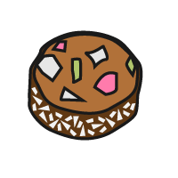

## Upgrade your project

If you have time, you can add more cards to your project. 

--- task ---

Customise the styling of your card in `style.css`. You could:

+ Alter the animation settings in the `card-content` class:
    + Change the seconds in the `transition: transform 1s;` line of code.
    + Change the persective size in the `perspective: 60rem;` line of code.

+ Amend the colour gradient 
    + Choose new colours for `secondary` and `detail` variables to change the front card face
    + Choose new colours for `tertiary` and `detail2` variables to change the back card face
    + Change the gradient direction in the `gradient1` and `gradient2` classes (try `top` or `bottom left`)

+ Import a new fancy font to the `index.html` <head> tag and update the `--title-font` and `--body-font` classes.

--- /task ---

--- task ---

Use your skills from [Anime expressions](http://rpf.io/anime-expressions){:target="_blank"} project and [Top 5 emoji list](http://rpf.io/top-5-emoji-list){:target="_blank"} project to add:
+ a header
+ a footer
+ a quote

--- /task ---

--- task ---

To add another card, copy the completed card code below and paste it into `index.html` underneath your first card:

--- code ---
---
language: html
filename: index.html
---
    <section class="wrap">
        

          

            

              
            

            

              <h2>TreatName</h2>
              
TreatDescription

            

          

        

    </section>

--- /code ---

Replace `ImageName`, `TreatName` and `TreatDescription` with your choosen treats from the list below. 

--- collapse ---

---
title: Bara Brith
---

ImageName: BaraBrith.png
TreatName: Bara Brith
TreatDescription: A bread with dried fruit and spices. It is flavoured with tea. 

--- /collapse ---

--- collapse ---

---
title: Breskvice
---

ImageName: Breskvice01.png or Breskvice02.png
TreatName: Breskvice
TreatDescription: Peach shaped treats with one half coloured red and the other yellow. 

--- /collapse ---

--- collapse ---

---
title: Brigadeiro
---

ImageName: Brigadeiro.png
TreatName: Brigadeiro
TreatDescription: A sweet and gooey chocolatey treat often served in a small paper cup.

--- /collapse ---

--- collapse ---

---
title: Dango
---

ImageName: Dango01.png or Dango02.png
TreatName: Dango
TreatDescription: A dumping made from rice flour served on a skewer.

--- /collapse ---

--- collapse ---

---
title: DatePalm
---

ImageName: DatePalm01.png or DatePalm02.png
TreatName: Date Palm
TreatDescription: From the date palm tree, these sweet treats can be eaten fresh or dried. 

--- /collapse ---

--- collapse ---

---
title: Eclair
---

ImageName: Eclair.png
TreatName: Eclair
TreatDescription: Choux pastry filled with cream and topped with flavoured icing.

--- /collapse ---

--- collapse ---

---
title: Fairy Bread
---

ImageName: FairyBread.png
TreatName: Fairy Bread
TreatDescription: A fun, colourful treat made from white bread, butter and sprinkles.

--- /collapse ---

--- collapse ---

---
title: French Fancy
---

ImageName: FrenchFancy.png
TreatName: French Fancy
TreatDescription: A sponge cake with a vanilla topping all covered in coloured icing.

--- /collapse ---

--- collapse ---

---
title: Halva
---

ImageName: Halva.png
TreatName: Halva
TreatDescription: It's popularity around the world has led to many variations of this treat sweetened with sugar and honey. 

--- /collapse ---

--- collapse ---

---
title: Jalebi
---

ImageName: Jalebi.png
TreatName: Jalebi
TreatDescription: A deep fried sweet snack in prezel or circular shapes.

--- /collapse ---

--- collapse ---

---
title: Knafeh
---

ImageName: Knafeh.png
TreatName: Knafeh
TreatDescription: A dessert pastry made from syrup soaked pastry with a cheese filling.

--- /collapse ---

--- collapse ---

---
title: Ladoo
---

ImageName: Ladoo.png
TreatName: Ladoo
TreatDescription: Round fried balls made from flour, butter and sugar.

--- /collapse ---

--- collapse ---

---
title: Lolly Cake
---

ImageName: LollyCake.png
TreatName: Lolly Cake
TreatDescription: A log cake rolled in coconut and filled with lollies or candy then chopped into slices. 

--- /collapse ---

--- collapse ---

---
title: Maejakgwa
---

ImageName: Maejakgwa01.png or Maejakgwa02.png
TreatName: Maejakgwa
TreatDescription: Fried sweet ginger cookies coated in syrup.

--- /collapse ---

--- collapse ---

---
title: Mandazi
---

ImageName: Mandazi.png
TreatName: Mandazi
TreatDescription: Triangle or rectangle shaped fried bread donuts.

--- /collapse ---

--- collapse ---

---
title: Maple Leaf Biscuit
---

ImageName: MapleLeafBiscuit.png
TreatName: Maple Leaf Biscuit
TreatDescription: Biscuits sandwiched together with a middle maple syrup cream filling.

--- /collapse ---

--- collapse ---

---
title: Oliebollen
---

ImageName: Oliebollen.png
TreatName: Oliebollen
TreatDescription: A fried bread mixed with fruit and shaped into balls. 

--- /collapse ---

--- collapse ---

---
title: Party Ring
---

ImageName: PartyRing.png
TreatName: Party Ring
TreatDescription: A kind of biscuit with a layer of hard coloured icing on top.

--- /collapse ---

--- collapse ---

---
title: Tim Tams
---

ImageName: TimTams.png
TreatName: Tim Tams
TreatDescription: A chocolate biscuit with chocolate cream filling and hard chocolate covering.

--- /collapse ---

--- collapse ---

---
title: Zarda
---

ImageName: Zarda.png
TreatName: Zarda
TreatDescription: A fragrant, yellow sweet rice dessert often baked with dried fruit or nuts. 

--- /collapse ---

--- /task ---

--- collapse ---

---
title: Completed project
---

You can view the [completed project here](https://trinket.io/html/d32996ce0d?runMode=autorun){:target="_blank"}.

--- /collapse ---

--- save ---

