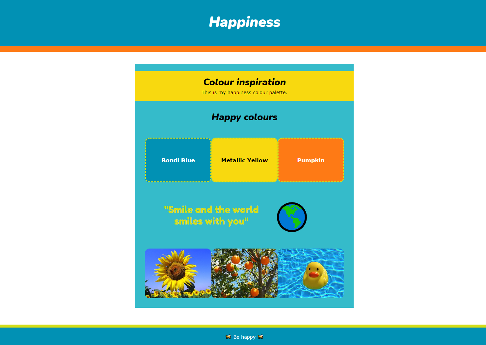

## What next?

If you are following the [Intro to web](https://projects.raspberrypi.org/en/pathways/web-intro) path, you can move on to the [Mood board](https://projects.raspberrypi.org/en/projects/mood-board) project. In this project, you will make a webpage that combines colours, fonts, and images to create a look or style for an idea of your choice.

\--- print-only ---

\--- /print-only ---

\--- no-print ---

### Try it

  
Take a look at the different styles that have been applied to the elements on this mood board. How many can you find?

**Happiness**: [See inside](https://editor.raspberrypi.org/en/projects/happiness-mood-board){:target="_blank"}

<iframe src="https://editor.raspberrypi.org/en/embed/viewer/happiness-mood-board" width="600" height="500" frameborder="0" marginwidth="0" marginheight="0" allowfullscreen> </iframe>

\--- /no-print ---
