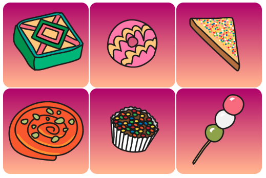

## Introduction

Dans ce projet, tu créeras une carte à retourner avec une friandise du monde entier. La carte se retourne lorsque tu la survoles ou que tu appuies dessus.

**Les cartes à retourner** aident les gens à interagir avec une page web. Les cartes à retourner te permettent également de fournir des informations supplémentaires dans un espace réduit ou de cacher des informations qui ne devraient pas être directement visibles. Quelques exemples courants de cartes à retourner animées sont les cartes de révision, les cartes de visite, les cartes de contact des réseaux sociaux et les cartes de produits. 

Tu vas :

- Utiliser des animations CSS pour créer une **carte qui se retourne** lorsqu'on interagit avec elle
- Appliquer un arrière-plan **dégradé** en utiliser le CSS
- Ajouter et utiliser une police de **Google Fonts**

\--- no-print ---

\--- task ---

### Essaie-le

Découvre cette carte web. Que se passe-t-il lorsque tu la survoles ?

As-tu remarqué les dégradés de l'arrière-plan et la police de caractères fantaisiste ?

<iframe src="https://editor.raspberrypi.org/en/embed/viewer/flip-treat-webcards-step-5" width="550" height="400" frameborder="0" marginwidth="0" marginheight="0" allowfullscreen> </iframe>

\--- /task ---

\--- /no-print ---

\--- print-only ---

\--- /print-only ---

