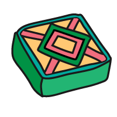

## Créer ta carte

<div style="display: flex; flex-wrap: wrap">
<div style="flex-basis: 200px; flex-grow: 1; margin-right: 15px;">
Dans cette étape, tu vas créer une infocarte pour une friandise savoureuse avec une image, un titre et un texte.
</div>
<div>
<iframe src="https://editor.raspberrypi.org/en/embed/viewer/flip-treat-webcards-step-2" width="500" height="400" frameborder="0" marginwidth="0" marginheight="0" allowfullscreen> </iframe>
</div>
</div>

\--- task ---

Ouvre le [Projet de démarrage Carte web de friandises à retourner](https://editor.raspberrypi.org/fr-FR/projects/flip-treat-webcards-starter){:target="_blank"}.

\--- /task ---

\--- task ---

La balise `<title>` dans ton code est utilisée pour afficher du texte dans la barre de titre de ton navigateur web. Ce texte doit être en rapport avec ta page web.

Tu peux trouver le `<title>` dans l'élément `<head>` en haut de ton fichier `index.html`.

**Change** ton titre par `Cartes de friandises à retourner`.

## --- code ---

language: html
filename: index.html
line_numbers: true
line_number_start: 1
line_highlights: 13
--------------------------------------------------------

<!DOCTYPE html>

<html lang="en">

<!-- This part is for extra information the browser needs to load the page correctly-->

<head>

  <meta charset="utf-8">

  <!-- Don't shrink the page on mobile -->

  <meta name="viewport" content="width=device-width, initial-scale=1.0">

  <!-- Appears on the web browser tab and search results -->

  <title>Treat flip cards</title> 

\--- /code ---

\--- /task ---

\--- task ---

Clique sur le petit triangle à côté de la balise `<head>` pour réduire le `<head>`.

Tu peux réduire les parties du code sur lesquelles tu n'as pas besoin de te concentrer pour rendre ton code plus facile à lire.

\--- /task ---

\--- task ---

Ajoute une `<section>` à la partie `<main>` de ta page. Donne à la classe `<section>` une classe `wrap` pour que ta page web soit responsive.

## --- code ---

language: html
filename: index.html
line_numbers: true
line_number_start: 26
line_highlights: 29-31
-----------------------------------------------------------

<body>

```
<main>
  <section class="wrap">
    
  </section>
```

\--- /code ---

\--- /task ---

<p style="border-left: solid; border-width:10px; border-color: #0faeb0; background-color: aliceblue; padding: 10px;">
<span style="color: #0faeb0">**Les graphistes**</span> sont des personnes qui créent des contenus visuels physiques ou numériques attrayants. Parmi les exemples de travaux de conception graphique, on peut citer les logos d'entreprise, les emballages de produits et la conception de bannières de sites web. Notre graphiste Kate a créé des images de friandises du monde entier que tu peux utiliser dans ton projet. 


</p>

L'élément `<div>` est utilisé pour regrouper d'autres éléments. L'élément `<div>` est utilisé lorsqu'il n'existe pas de balise plus appropriée, comme `<section>` et `<blockquote>`.

\--- task ---

Crée un `<div>` qui contient une image. La première image est `LapisSarawak02.png`, une friandise de Malaisie.



## --- code ---

language: html
filename: index.html
line_numbers: true
line_number_start: 29
line_highlights: 30-32
-----------------------------------------------------------

```
<section class="wrap">
  <div>
      
  </div>
</section>
```

\--- /code ---

\--- /task ---

\--- task ---

Ajoute un autre `<div>` avec un titre et un court paragraphe sur Lapis Sarawak :

Titre : `Lapis Sarawak`
Paragraphe : `Un gâteau cuit en couches pour créer des motifs colorés.`

## --- code ---

language: html
filename: index.html
line_numbers: true
line_number_start: 29
line_highlights: 33-36
-----------------------------------------------------------

```
<section class="wrap">
  <div>
    
  </div>
  <div>
    <h2>Lapis Sarawak</h2>
    <p>A cake baked in layers to make colourful patterns.</p>
  </div>
</section>
    
```

\--- /code ---

\--- /task ---

\--- task ---

**Test :** clique sur le bouton **Run**.

Regarde ta page web. Tu dois pouvoir voir l'image d'un Lapis Sarawak et ton texte qui décrit l'image.

<div>
<iframe src="https://editor.raspberrypi.org/en/embed/viewer/flip-treat-webcards-step-2" width="500" height="450" frameborder="0" marginwidth="0" marginheight="0" allowfullscreen> </iframe>

</div>

\--- /task ---
