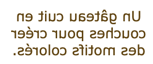

## Retourner ta carte

<div style="display: flex; flex-wrap: wrap">
<div style="flex-basis: 200px; flex-grow: 1; margin-right: 15px;">
Dans cette étape, tu vas créer une carte qui se retourne avec du contenu au recto et au verso.
</div>
<div>
<iframe src="https://editor.raspberrypi.org/en/embed/viewer/flip-treat-webcards-step-3" width="500" height="400" frameborder="0" marginwidth="0" marginheight="0" allowfullscreen> </iframe>
</div>
</div>

Utilise les balises `<div></div>` pour structurer ton code et séparer les parties principales de la carte :

- La carte à retourner
  - Le contenu visible
    - Le recto de la carte
    - Le verso de la carte

\--- task ---

La classe `card` est déjà créée dans `style.css`. La classe `card` définit la largeur, la hauteur et la bordure de la carte.

Ajoute des balises `<div></div>` autour de ton code Lapis Sarawak actuel avec la classe CSS `card`.

## --- code ---

language: html
filename: index.html
line_numbers: true
line_number_start: 28
line_highlights: 30, 38
------------------------------------------------------------

```
<main>
    <section class="wrap">
      <div class="card">
        <div>
          
        </div>
        <div>
          <h2>Lapis Sarawak</h2>
          <p>A cake baked in layers to make colourful patterns.</p>
        </div>
      </div>
    </section>
```

\--- /code ---

\--- /task ---

\--- task ---

La classe `card-content` est déjà créée dans `style.css`. La classe `card-conten` contrôle le timing, la perspective et l'effet 3D du retournement.

Ajoute une autre série de balises `<div></div>` à l'intérieur de ta carte avec la classe CSS `card-content`.

## --- code ---

language: html
filename: index.html
line_numbers: true
line_number_start: 28
line_highlights: 31, 39
------------------------------------------------------------

```
<main>
    <section class="wrap">
      <div class="card">
        <div class="card-content">
          <div>
            
          </div>
          <div>
            <h2>Lapis Sarawak</h2>
            <p>A cake baked in layers to make colourful patterns.</p>
          </div>
        </div>
      </div>
    </section>
```

\--- /code ---

\--- /task ---

\--- task ---

**Test :** clique sur le bouton **Run**.

Survole (ou appuie sur) la carte sur ta page web. Le contenu doit se retourner.

Que remarques-tu dans le contenu ?

\--- /task ---

\--- task ---

Ajoute la classe `card-face` à la balise `<div>` autour de l'image. La classe `card-face` indique aux éléments qu'elle contient de se cacher lorsqu'ils sont retournés.

## --- code ---

language: html
filename: index.html
line_numbers: true
line_number_start: 28
line_highlights: 32
--------------------------------------------------------

```
<main>
    <section class="wrap">
      <div class="card">
        <div class="card-content">
          <div class="card-face">
            
          </div>
          <div>
            <h2>Lapis Sarawak</h2>
            <p>A cake baked in layers to make colourful patterns.</p>
          </div>
        </div>
      </div>
    </section> 
```

\--- /code ---

\--- /task ---

\--- task ---

**Test :** clique sur le bouton **Run**.

Survole (ou appuie sur) la carte sur ta page web. L'image et le texte apparaissent l'un sur l'autre, mais l'image doit se cacher lorsque la carte est retournée.

\--- /task ---

\--- task ---

Ajoute la classe `card-face` à la balise `<div>` autour du titre et du paragraphe. Cela permet de masquer l'en-tête et le paragraphe lorsqu'ils sont retournés.

## --- code ---

language: html
filename: index.html
line_numbers: true
line_number_start: 28
line_highlights: 35
--------------------------------------------------------

```
<main>
    <section class="wrap">
      <div class="card">
        <div class="card-content">
          <div class="card-face">
            
          </div>
          <div class="card-face">
            <h2>Lapis Sarawak</h2>
            <p>A cake baked in layers to make colourful patterns.</p>
          </div>
        </div>
      </div>
    </section> 
```

\--- /code ---

\--- /task ---

\--- task ---

**Test :** clique sur le bouton **Run**.

Survole (ou appuie sur) la carte sur ta page web. L'image et le texte apparaissent maintenant au recto de la carte et sont tous deux cachés lorsque la carte est retournée.

\--- /task ---

Le texte doit apparaître sur le verso de la carte et non sur le recto. Auparavant, lorsque le texte apparaissait au verso, il était inversé, de sorte qu'il ne pouvait être lu qu'à l'envers, de droite à gauche. Tu peux résoudre ces deux problèmes avec un seul bout de code.



\--- task ---

Ajoute la classe `flipme` à la balise `<div>` autour du titre et du paragraphe. Cette opération fait pivoter le texte de 180 degrés pour qu'il soit retourné sur le verso et qu'il puisse être lu correctement.

## --- code ---

language: html
filename: index.html
line_numbers: true
line_number_start: 28
line_highlights: 35
--------------------------------------------------------

```
<main>
    <section class="wrap">
      <div class="card">
        <div class="card-content">
          <div class="card-face">
            
          </div>
          <div class="card-face flipme">
            <h2>Lapis Sarawak</h2>
            <p>A cake baked in layers to make colourful patterns.</p>
          </div>
        </div>
      </div>
    </section> 
```

\--- /code ---

\--- /task ---

\--- task ---

**Test :** clique sur le bouton **Run**.

Survole (ou appuie sur) la carte sur ta page web pour voir ta carte à retourner.

<iframe src="https://editor.raspberrypi.org/en/embed/viewer/flip-treat-webcards-step-3" width="500" height="400" frameborder="0" marginwidth="0" marginheight="0" allowfullscreen> </iframe>

\--- /task ---

\--- task ---

**Choisir :** va dans le fichier `style.css` et modifie le paramètre de la classe `card-content` pour utiliser le timing que tu préfères.

Tu pourrais :

- Modifier les secondes dans la ligne de code `transition: transform 1s;`.

## --- code ---

language: css
filename: style.css
line_numbers: true
line_number_start: 272
line_highlights: 277
---------------------------------------------------------

.card-content {
position: relative;
width: 100%;
height: 100%;
text-align: center;
transition: transform 1s;
transform-style: preserve-3d;
perspective: 60rem;
}

\--- /code ---

\--- /task ---

