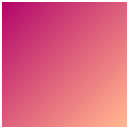

## Styliser ta carte

<div style="display: flex; flex-wrap: wrap">
<div style="flex-basis: 200px; flex-grow: 1; margin-right: 15px;">
Dans cette étape, tu ajouteras des dégradés de couleurs et des coins arrondis à ta carte. Tu aligneras également le texte de façon à ce qu'il apparaisse au centre de la carte. 
</div>
<div>
<iframe src="https://editor.raspberrypi.org/en/embed/viewer/flip-treat-webcards-step-4" width="500" height="400" frameborder="0" marginwidth="0" marginheight="0" allowfullscreen> </iframe>
</div>
</div>

<p style="border-left: solid; border-width:10px; border-color: #0faeb0; background-color: aliceblue; padding: 10px;">
<span style="color: #0faeb0">**Les dégradés de couleurs**</span> sont un passage progressif d'une couleur à une autre. Pour déterminer comment un dégradé de couleurs lisse peut être rendu, les ordinateurs calculent les positions et les teintes nécessaires pour passer de la couleur de départ à la couleur finale. 


</p>

Les dégradés sont utilisés pour que ta carte attire l'attention de l'utilisateur.

\--- task ---

Ajoute la classe `gradient1` à la classe `<div>` qui affiche l'image.

La classe `gradient1` utilise un dégradé linéaire qui passe en diagonale d'une couleur en haut à une autre couleur en bas.



## --- code ---

language: html
filename: index.html
line_numbers: true
line_number_start: 28
line_highlights: 32
--------------------------------------------------------

```
<main>
    <section class="wrap">
      <div class="card">
        <div class="card-content">
          <div class="card-face gradient1">
            
          </div>
          <div class="card-face flipme">
            <h2>Lapis Sarawak</h2>
            <p>A cake baked in layers to make colourful patterns.</p>
          </div>
        </div>
      </div>
    </section> 
```

\--- /code ---

\--- /task ---

\--- task ---

Ajoute la classe `gradient2` au `<div>` qui affiche le titre et le paragraphe.

La classe `gradient2` utilise un dégradé linéaire qui passe en diagonale d'une couleur en haut à une autre couleur en bas à droite.


## --- code ---

language: html
filename: index.html
line_numbers: true
line_number_start: 28
line_highlights: 35
--------------------------------------------------------

```
<main>
    <section class="wrap">
      <div class="card">
        <div class="card-content">
          <div class="card-face gradient1">
            
          </div>
          <div class="card-face flipme gradient2">
            <h2>Lapis Sarawak</h2>
            <p>A cake baked in layers to make colourful patterns.</p>
          </div>
        </div>
      </div>
    </section> 
```

\--- /code ---

\--- /task ---

\--- task ---

**Test :** clique sur le bouton **Run**.

Survole (ou appuie sur) la carte dans ta page web pour voir que les deux dégradés ont été ajoutés.

<div>
<iframe src="https://editor.raspberrypi.org/en/embed/viewer/flip-treat-webcards-step-4a" width="500" height="400" frameborder="0" marginwidth="0" marginheight="0" allowfullscreen> </iframe>
</div>

\--- /task ---

\--- task ---

Clique sur le fichier `default.css` et trouve la palette de couleurs près du haut de la page.

**Choisir :** les dégradés de couleurs utilisent des variables de la palette de couleurs. Choisis les dégradés qui te plaisent le plus parmi ces options :


1. \#7b4397 → #dc2430
2. \#43cea2 → #185a9d
3. \#bdc3c7 → #2c3e50
4. \#56ab2f → #a8e063
5. \#eecda3 → #ef629f
6. \#000428 → #004e92

**Mets à jour** les variables pour voir le recto et le verso de la carte dans ton nouveau dégradé :

- Le recto de la carte utilise les variables `secondary` et `detail`
- Le verso de la carte utilise les variables `tertiary` et `detail2`

**Astuce :** il se peut que tu doives également modifier les couleurs `onsecondary` et `ontertiary` pour que ton texte puisse être lu sur les nouveaux dégradés de couleur.

## --- code ---

language: css
filename: default.css
line_numbers: true
line_number_start: 1
line_highlights: 5-6, 9-10, 12-13
----------------------------------------------------------------------

/\* Configurer la palette de couleurs et les polices en utilisant les variables \*/

:root {
\--primary: #ffffff;
\--secondary: #aa076b;
\--tertiary: #43cea2;
\--page: #ffffff;
\--onprimary: #664300;
\--onsecondary: #664300;
\--ontertiary: #ffffff;
\--onpage: #000000;
\--detail: #ffb88c;
\--detail2: #185a9d;

\--- /code ---

\--- /task ---

\--- task ---

Click on the `style.css` file and find the `gradient1` and `gradient2` classes.

**Choisir :** mets à jour le dégradé dans la direction que tu préfères. Essaie `top`, `right`, ou `bottom left`.

## --- code ---

language: css
filename: style.css
line_numbers: true
line_number_start: 243
line_highlights: 245, 254
--------------------------------------------------------------

.gradient1 {
background-image: linear-gradient(
to bottom right,
var(--secondary),
var(--detail)
);
color: var(--onsecondary);
}

.gradient2 {
background-image: linear-gradient(
to bottom right,
var(--tertiary),
var(--detail2)
);
color: var(--ontertiary);
}

\--- /code ---

\--- /task ---

\--- task ---

Clique sur 'index.html`. Ajoute la classe `rounded\` aux deux faces de ta carte pour ajouter des coins arrondis à ta carte.

## --- code ---

language: html
filename: index.html
line_numbers: true
line_number_start: 28
line_highlights: 32, 35
------------------------------------------------------------

```
<main>
    <section class="wrap">
      <div class="card">
        <div class="card-content">
          <div class="card-face gradient1 rounded">
            
          </div>
          <div class="card-face flipme gradient2 rounded">
            <h2>Lapis Sarawak</h2>
            <p>A cake baked in layers to make colourful patterns.</p>
          </div>
        </div>
      </div>
    </section> 
```

\--- /code ---

\--- /task ---

\--- task ---

**Test :** clique sur le bouton **Run**.

Survole (ou appuie sur) la carte dans ta page web pour vérifier que les deux côtés de la carte ont des coins arrondis.

<div>
<iframe src="https://editor.raspberrypi.org/en/embed/viewer/flip-treat-webcards-step-4b" width="500" height="400" frameborder="0" marginwidth="0" marginheight="0" allowfullscreen> </iframe>
</div>

\--- /task ---

\--- task ---

Le texte sur la carte n'est pas aligné correctement.


Ajoute la classe `ycenter` pour aligner le texte au centre le long de l'axe `y`.


## --- code ---

language: html
filename: index.html
line_numbers: true
line_number_start: 28
line_highlights: 35
--------------------------------------------------------

```
<main>
    <section class="wrap">
      <div class="card">
        <div class="card-content">
          <div class="card-face gradient1 rounded">
            
          </div>
          <div class="card-face flipme gradient2 rounded ycenter">
            <h2>Lapis Sarawak</h2>
            <p>A cake baked in layers to make colourful patterns.</p>
          </div>
        </div>
      </div>
    </section> 
```

\--- /code ---

\--- /task ---

\--- task ---

**Test :** clique sur le bouton **Run**.

Survole (ou appuie sur) la carte dans ta page web pour vérifier que le texte de la seconde face est aligné au centre de l'axe `y`.

<div>
<iframe src="https://editor.raspberrypi.org/en/embed/viewer/flip-treat-webcards-step-4c" width="500" height="400" frameborder="0" marginwidth="0" marginheight="0" allowfullscreen> </iframe>
</div>

\--- /task ---

\--- task ---

Utilise la classe `shadow` pour ajouter une ombre aux deux côtés de ta carte.

## --- code ---

language: html
filename: index.html
line_numbers: true
line_number_start: 28
line_highlights: 32, 35
------------------------------------------------------------

```
<main>
    <section class="wrap">
      <div class="card">
        <div class="card-content">
          <div class="card-face gradient1 rounded shadow">
            
          </div>
          <div class="card-face flipme gradient2 rounded ycenter shadow">
            <h2>Lapis Sarawak</h2>
            <p>Un gâteau cuit en couches pour créer des motifs colorés.</p>
          </div>
        </div>
      </div>
    </section> 
```

\--- /code ---

\--- /task ---

\--- task ---

**Test :** clique sur le bouton **Run**.

Survole (ou appuie sur) la carte dans ta page web pour vérifier que la carte a maintenant une ombre.

<iframe src="https://editor.raspberrypi.org/en/embed/viewer/flip-treat-webcards-step-4" width="500" height="400" frameborder="0" marginwidth="0" marginheight="0" allowfullscreen> </iframe>

\--- /task ---


