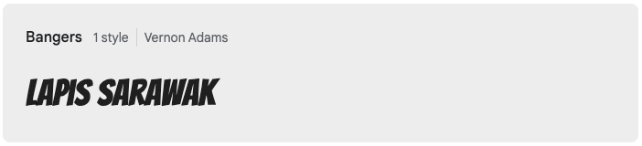
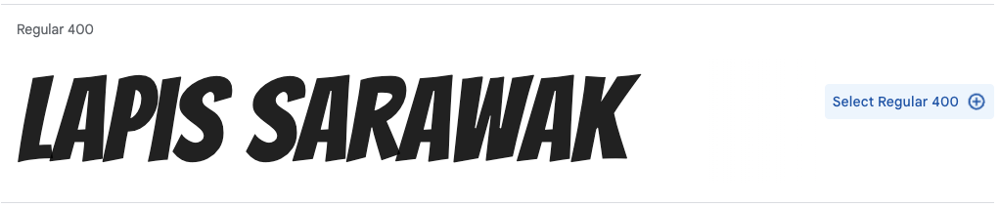

## Choisir ta police

Tu vas maintenant utiliser la bibliothèque de polices en ligne de Google pour importer une police décorative dans ta page web.

<iframe src="https://editor.raspberrypi.org/fr-FR/embed/viewer/flip-treat-webcards-step-5" width="500" height="400" frameborder="0" marginwidth="0" marginheight="0" allowfullscreen> </iframe>

**Les concepteurs web** doivent tenir compte de l'apparence d'un site web et de la façon dont il reflète la marque de l'entreprise, du produit ou de la personne pour laquelle ils conçoivent le site web. Les polices standard sûres pour le web sont recommandées pour la majorité du texte d'une page web. Lorsqu'un concepteur veut créer un impact, il peut utiliser une police plus unique. Les concepteurs peuvent importer des **web fonts** à partir d'une bibliothèque de polices en ligne pour que leur site web attire l'attention des gens.

[[[web-fonts]]]

Google propose une bibliothèque de polices en ligne gratuite avec plus de 1 500 polices au choix. Le site te permet d'utiliser ton propre échantillon de texte pour parcourir différentes polices et t'aider à trouver la bonne police. Google te donne ensuite le code **HTML** dont tu as besoin pour **importer** la police dans ton site web.

--- task ---

Ouvre [fonts.google.com](https://fonts.google.com/){:target="_blank"}. Le lien s'ouvrira dans un nouvel onglet.

--- /task ---

--- task ---

Tape un exemple de texte dans la case **Preview**. Dans l'exemple, le nom `Lapis Sarawak` est utilisé.

**Remarque** que les exemples montrent ton modèle de texte. Tu peux voir à quoi ressembleront tes mots dans toutes les polices disponibles.

--- /task ---

Il existe de nombreux filtres de recherche différents. Tu peux effectuer une recherche par langue ou par différentes propriétés de police.

--- task ---

Saisis le nom de la police `Bangers` dans la case 'search fonts'.

**Remarque** que tu peux maintenant voir un exemple de la police Bangers qui a été appliquée au texte de l'échantillon.

--- /task ---

--- task ---

Clique sur la carte Bangers qui est apparue dans les résultats de la recherche.

--- /task ---

--- task ---

Clique sur le lien 'Select' (notre exemple montre 'Select Regular 400').

**Remarque** qu'une fenêtre apparaît sur le côté. La fenêtre te donnera le code dont tu as besoin.

--- /task ---

--- task ---

Clique sur l'icône de copie pour copier le code HTML.

--- /task ---

--- task ---

Développe la section `<head>` de `index.html`, si elle est réduite.

Trouve le commentaire dans ton document `index.html` qui dit `<!-- Importer des polices de Google -->`.

Colle le code HTML que tu viens de copier sous le commentaire.

--- code ---
---
language: html
filename: index.html
line_numbers: true
line_number_start: 15
line_highlights: 16-18
---
  <!-- Importer des polices depuis Google -->
  <link rel="preconnect" href="https://fonts.googleapis.com">
  <link rel="preconnect" href="https://fonts.gstatic.com" crossorigin>
  <link href="https://fonts.googleapis.com/css2?family=Bangers&display=swap" rel="stylesheet">

--- /code ---

--- /task ---

Tu as maintenant importé les polices dont tu as besoin depuis la bibliothèque Google Fonts. Ensuite, ajoute le CSS correct pour que le navigateur web sache quand utiliser cette police.

--- task ---

Va dans ton fichier `default.css` et trouve les variables `header-font` et `title-font`.

**Remplace** la police actuelle `Verdana` par `Bangers`.

--- code ---
---
language: css
filename: default.css
line_numbers: true
line_number_start: 15
line_highlights: 16-17
---
  --body-font: 1.1rem Verdana, sans-serif;
  --header-font: lighter 3rem Bangers, cursive;
  --title-font: lighter 2rem Bangers, cursive;

--- /code ---

--- /task ---

--- task ---

**Test :** clique sur le bouton **Run**.

Survole (ou appuie sur) ta carte à retourner dans la fenêtre de prévisualisation. Tu devrais voir ta nouvelle police appliquée à l'en-tête du verso de la carte.

<iframe src="https://editor.raspberrypi.org/fr-FR/embed/viewer/flip-treat-webcards-step-5" width="500" height="400" frameborder="0" marginwidth="0" marginheight="0" allowfullscreen> </iframe>

--- /task ---

--- task ---

**Choisir :** pour choisir ta propre police, retourne sur [fonts.google.com](https://fonts.google.com/){:target="_blank"}.

**Supprime** le style Bangers dans Google Fonts avant de sélectionner ta nouvelle police.

**Astuce** n'oublie pas de mettre à jour ton fichier `default.css` pour y inclure le nouveau nom de la police.

--- /task ---

--- collapse ---

---
title: Le projet terminé
---

Tu peux voir le [projet terminé ici](https://editor.raspberrypi.org/fr-FR/projects/flip-treat-webcards-step-5){:target="_blank"}.

--- /collapse ---
