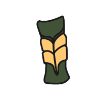
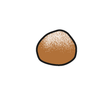

## Améliorer ton projet

Si tu as le temps, tu peux ajouter d'autres cartes à ton projet, personnaliser l'animation et les couleurs, ou ajouter un en-tête et un pied de page.

### Ajouter d'autres cartes

<iframe src="https://editor.raspberrypi.org/en/embed/viewer/flip-treat-webcards-step-7" width="550" height="710" frameborder="0" marginwidth="0" marginheight="0" allowfullscreen> </iframe>

\--- task ---

Pour ajouter une autre carte, copie le code de la carte complétée ci-dessous et colle-le dans `index.html` sous ta première carte :

## --- code ---

language: html
filename: index.html
----------------------------------------------------

```
<section class="wrap">
    <div class="card">
      <div class="card-content">
        <div class="card-face gradient1 rounded">
          
        </div>
        <div class="card-face flipme gradient2 rounded ycenter">
          <h2>TreatName</h2>
          <p>TreatDescription</p>
        </div>
      </div>
    </div>
</section>
```

\--- /code ---

Remplace `NomImage`, `NomFriandise`, et `DescriptionFriandise`, par les friandises que tu as choisies dans la liste ci-dessous.

**Remarques :** n'oublie pas de mettre à jour le texte alternatif pour chaque image.

\--- collapse ---

---

## title: Bara Brith


**NomImage:** BaraBrith.png
**NomFriandise:** Bara Brith
**DescriptionFriandise:** Un pain aux fruits secs et aux épices. Le Bara Brith est aromatisé au thé.

\--- /collapse ---

\--- collapse ---

---

## title: Breskvice


**NomImage:** Breskvice01.png ou Breskvice02.png
**NomFriandise:** Breskvice
**DescriptionFriandise:** Friandises en forme de pêche dont une moitié est colorée en rouge et l'autre en jaune.

\--- /collapse ---

\--- collapse ---

---

## title: Brigadeiro


**NomImage:** Brigadeiro.png
**NomFriandise:** Brigadeiro
**DescriptionFriandise:** Une friandise chocolatée sucrée et gluante qui est souvent servie dans un petit gobelet en papier.

\--- /collapse ---

\--- collapse ---

---

## title: Dango


**NomImage:** Dango01.png ou Dango02.png
**NomFriandise:** Dango
**DescriptionFriandise:** Boulette de farine de riz servie sur une brochette.

\--- /collapse ---

\--- collapse ---

---

## title: Dattier


**NomImage:** DatePalm01.png ou DatePalm02.png
**NomFriandise:** Dattier
**DescriptionFriandise:** Issues du dattier, ces friandises peuvent être consommées fraîches ou séchées.

\--- /collapse ---

\--- collapse ---

---

## title: Eclair


**NomImage:** Eclair.png
**NomFriandise:** Eclair
**DescriptionFriandise:** Pâte à choux fourrée de crème et garnie d'un glaçage aromatisé.

\--- /collapse ---

\--- collapse ---

---

## title: Fairy Bread


**NomImage:** FairyBread.png
**NomFriandise:** Fairy Bread
**DescriptionFriandise:** Une friandise amusante et colorée à base de pain blanc, de beurre et de paillettes.

\--- /collapse ---

\--- collapse ---

---

## title: French Fancy


**NomImage:** FrenchFancy.png
**NomFriandise:** French Fancy
**DescriptionFriandise:** Une génoise nappée de vanille et recouverte d'un glaçage coloré.

\--- /collapse ---

\--- collapse ---

---

## title: Halva


**NomImage:** Halva.png
**NomFriandise:** Halva
**DescriptionFriandise:** La popularité du halva dans le monde entier a donné lieu à de nombreuses variantes de cette friandise sucrée au sucre et au miel.

\--- /collapse ---

\--- collapse ---

---

## title: Jalebi


**NomImage:** Jalebi.png
**NomFriandise:** Jalebi
**DescriptionFriandise:** Collations sucrées frites en forme de bretzel ou de cercle.

\--- /collapse ---

\--- collapse ---

---

## title: Knafeh


**NomImage:** Knafeh.png
**NomFriandise:** Knafeh
**DescriptionFriandise:** Dessert pâtissier composé d'une pâte imbibée de sirop et d'une garniture au fromage.

\--- /collapse ---

\--- collapse ---

---

## title: Ladoo


**NomImage:** Ladoo.png
**NomFriandise:** Ladoo
**DescriptionFriandise:** Boules rondes frites à base de farine, de beurre et de sucre.

\--- /collapse ---

\--- collapse ---

---

## title: Lolly Cake


**NomImage:** LollyCake.png
**NomFriandise:** Lolly Cake
**DescriptionFriandise:** Un gâteau en forme de bûche rempli de sucettes ou de bonbons, roulé dans de la noix de coco, puis coupé en tranches.

\--- /collapse ---

\--- collapse ---

---

## title: Maejakgwa



**NomImage:** Maejakgwa01.png ou Maejakgwa02.png
**NomFriandise:** Maejakgwa
**DescriptionFriandise:** Biscuits sucrés au gingembre frits et enrobés de sirop.

\--- /collapse ---

\--- collapse ---

---

## title: Mandazi


**NomImage:** Mandazi.png
**NomFriandise:** Mandazi
**DescriptionFriandise:** Le mandazi est un beignet de pain frit en forme de triangle ou de rectangle.

\--- /collapse ---

\--- collapse ---

---

## title: Biscuit feuille d'érable


**NomImage:** MapleLeafBiscuit.png
**NomFriandise:** Biscuit feuille d'érable
**DescriptionFriandise:** Des biscuits pris en sandwich avec une garniture centrale à base de crème au sirop d'érable.

\--- /collapse ---

\--- collapse ---

---

## title: Oliebollen



**NomImage:** Oliebollen.png
**NomFriandise:** Oliebollen
**DescriptionFriandise:** Pain frit mélangé à des fruits et façonné en boules.

\--- /collapse ---

\--- collapse ---

---

## title: Party Ring


**NomImage:** PartyRing.png
**NomFriandise:** Party Ring
**DescriptionFriandise:** Un type de biscuit avec une couche de glaçage dur et coloré sur le dessus.

\--- /collapse ---

\--- collapse ---

---

## title: Tim Tams


**NomImage:** TimTams.png
**NomFriandise:** Tim Tams
**DescriptionFriandise:** Biscuit au chocolat fourré d'une crème au chocolat et recouvert de chocolat dur.

\--- /collapse ---

\--- collapse ---

---

## title: Zarda


**NomImage:** Zarda.png
**NomFriandise:** Zarda
**DescriptionFriandise:** Dessert à base de riz sucré jaune et parfumé, souvent cuit avec des fruits secs ou des noix.

\--- /collapse ---

<iframe src="https://editor.raspberrypi.org/en/embed/viewer/flip-treat-webcards-step-7" width="550" height="710" frameborder="0" marginwidth="0" marginheight="0" allowfullscreen> </iframe>

\--- /task ---

### Créer ta page web

\--- task ---

Utilise tes compétences acquises des projets [Expressions d'anime](http://rpf.io/anime-expressions){:target="_blank"} et [Top 5 des emojis](http://rpf.io/top-5-emoji-list){:target="_blank"} pour ajouter :

- Un en-tête
- Un pied de page
- Une citation

\--- /task ---

\--- collapse ---

---

## title: Projet amélioré

Tu peux voir le [projet amélioré ici](https://editor.raspberrypi.org/fr-FR/projects/flip-treat-webcards-step-7){:target="_blank"}.

\--- /collapse ---

\--- save ---
