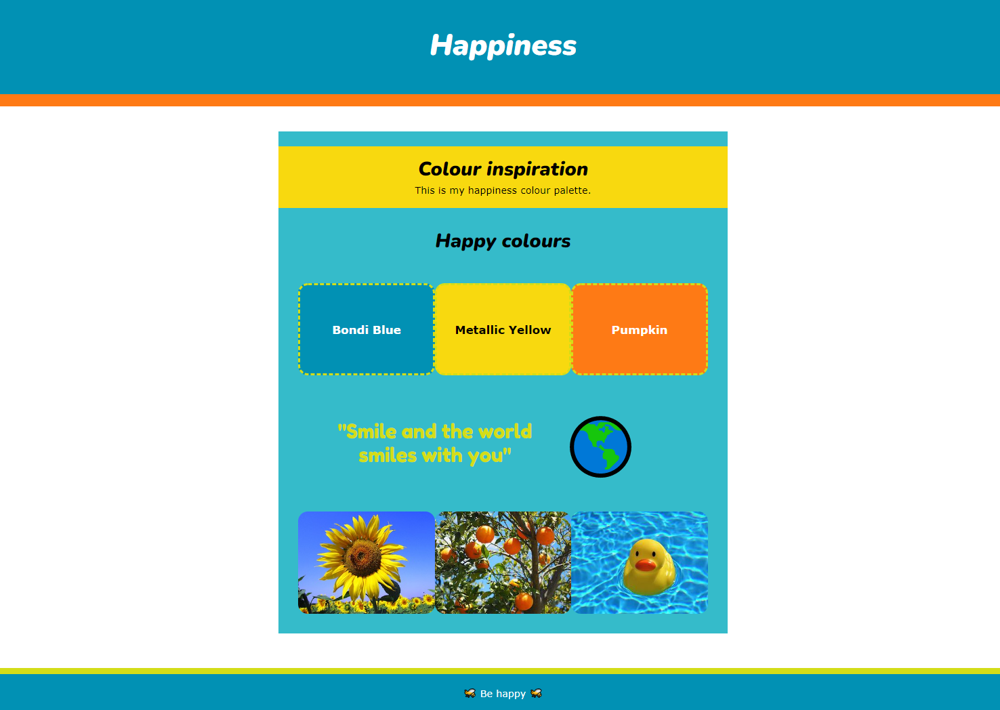

## Et ensuite ?

Si tu suis le parcours [Intro au web](https://projects.raspberrypi.org/fr-FR/pathways/web-intro), tu peux passer au projet [Tableau d'humeur](https://projects.raspberrypi.org/fr-FR/projects/mood-board). Dans ce projet, tu réaliseras une page web qui combine des couleurs, des polices et des images pour créer une apparence ou un style pour une idée de ton choix.

--- print-only ---

--- /print-only ---

--- no-print ---

### Essaie-le

  
Jette un coup d'œil aux différents styles qui ont été appliqués aux éléments de ce tableau d'humeur. Combien en trouves-tu ?

**Bonheur** : [voir à l'intérieur](https://editor.raspberrypi.org/fr-FR/projects/happiness-mood-board){:target="_blank"}

<iframe src="https://editor.raspberrypi.org/fr-FR/embed/viewer/happiness-mood-board" width="600" height="500" frameborder="0" marginwidth="0" marginheight="0" allowfullscreen> </iframe>

--- /no-print ---

***

Ce projet a été traduit par des bénévoles:

Jonathan Vannieuwkerke
Michel Arnols

Grâce aux bénévoles, nous pouvons donner aux gens du monde entier la chance d'apprendre dans leur propre langue. Vous pouvez nous aider à atteindre plus de personnes en vous portant volontaire pour la traduction - plus d'informations sur [rpf.io/translate](https://rpf.io/translate).
