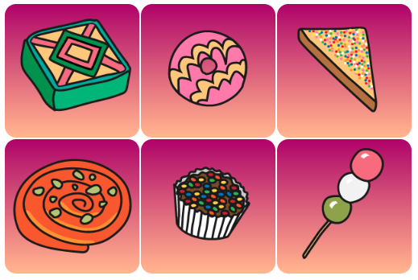

## Inleiding

In dit project maak je een flip card met een lekkernij van over de hele wereld. De kaart draait om als je erover beweegt of erop klikt of tikt.

**Flip cards** helpen mensen bij interactie met een webpagina. Met flip cards is het mogelijk om extra informatie in een kleine ruimte te geven of te verbergen zodat deze niet direct zichtbaar is. Sommige veel voorkomende voorbeelden van geanimeerde flip cards zijn revisie-kaarten, visitekaartjes, contactkaarten voor sociale media en productkaarten. 

Je gaat:

- CSS-animaties gebruiken om een **kaart te maken die omdraait** wanneer er mee wordt geinteracteerd
- Pas een **verloop** toe op de achtergrond met behulp van CSS
- Voeg een lettertype van **Google Fonts** toe en gebruik het

\--- no-print ---

\--- task ---

### Probeer het uit

Verken deze webcard. Wat gebeurt er als je erover gaat met je muis?

Heb je het kleurverloop in de achtergrond en het mooie lettertype opgemerkt?

<iframe src="https://editor.raspberrypi.org/en/embed/viewer/flip-treat-webcards-step-5" width="550" height="400" frameborder="0" marginwidth="0" marginheight="0" allowfullscreen> </iframe>

\--- /task ---

\--- /no-print ---

\--- print-only ---

\--- /print-only ---

