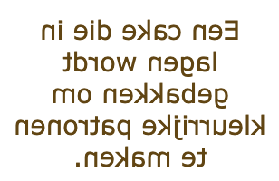

## Draai je kaart om

<div style="display: flex; flex-wrap: wrap">
<div style="flex-basis: 200px; flex-grow: 1; margin-right: 15px;">
In deze stap maak je een kaart die kan omdraaien, met inhoud aan de voor- en achterkant. 
</div>
<div>
<iframe src="https://editor.raspberrypi.org/en/embed/viewer/flip-treat-webcards-step-3" width="500" height="400" frameborder="0" marginwidth="0" marginheight="0" allowfullscreen> </iframe>
</div>
</div>

Gebruik `<div></div>` tags om je code te structureren en de belangrijkste delen van de kaart te scheiden:

- De flip card
  - De zichtbare inhoud
    - De voorkant van de kaart
    - De achterkant van de kaart

\--- task ---

De `card` class is al aangemaakt in `style.css`. De `card` class stelt de breedte, hoogte en rand van de kaart in.

Voeg `<div></div>` tags toe rond je huidige Lapis Sarawak code met de CSS class `card`.

## --- code ---

language: html
filename: index.html
line_numbers: true
line_number_start: 28
line_highlights: 30, 38
------------------------------------------------------------

```
<main>
    <section class="wrap">
      <div class="card">
        <div>
          
        </div>
        <div>
          <h2>Lapis Sarawak</h2>
          <p>A cake baked in layers to make colourful patterns.</p>
        </div>
      </div>
    </section>
```

\--- /code ---

\--- /task ---

\--- task ---

De `card-content` class is al aangemaakt in `style.css`. De `card-content` class regelt de timing, het perspectief en het 3D-effect van de draaiing.

Voeg nog een set van `<div></div>` tags toe in je kaart met de CSS class `card-content`.

## --- code ---

language: html
filename: index.html
line_numbers: true
line_number_start: 28
line_highlights: 31, 39
------------------------------------------------------------

```
<main>
    <section class="wrap">
      <div class="card">
        <div class="card-content">
          <div>
            
          </div>
          <div>
            <h2>Lapis Sarawak</h2>
            <p>A cake baked in layers to make colourful patterns.</p>
          </div>
        </div>
      </div>
    </section>
```

\--- /code ---

\--- /task ---

\--- task ---

**Test:** Klik op de **Run** knop.

Beweeg de muis over (of tik) op de kaart op je webpagina. De inhoud zou moeten omdraaien.

Wat valt je op aan de inhoud?

\--- /task ---

\--- task ---

Voeg de class `card-face` toe aan de tag `<div>` rond de afbeelding. De class `card-face` zorgt ervoor dat de elementen in die class worden verborgen wanneer ze naar achteren worden gedraaid.

## --- code ---

language: html
filename: index.html
line_numbers: true
line_number_start: 28
line_highlights: 32
--------------------------------------------------------

```
<main>
    <section class="wrap">
      <div class="card">
        <div class="card-content">
          <div class="card-face">
            
          </div>
          <div>
            <h2>Lapis Sarawak</h2>
            <p>A cake baked in layers to make colourful patterns.</p>
          </div>
        </div>
      </div>
    </section> 
```

\--- /code ---

\--- /task ---

\--- task ---

**Test:** Klik op de **Run** knop.

Beweeg de muis over (of tik) op de kaart op je webpagina. De afbeelding en de tekst verschijnen over elkaar heen, maar de afbeelding moet verborgen zijn als de kaart wordt omgedraaid.

\--- /task ---

\--- task ---

Voeg de `card-face` class toe aan de `<div>` tag rond de kop en alinea. Dit is om ervoor te zorgen dat de kop en de alinea worden verborgen als ze naar achteren worden gedraaid.

## --- code ---

language: html
filename: index.html
line_numbers: true
line_number_start: 28
line_highlights: 35
--------------------------------------------------------

```
<main>
    <section class="wrap">
      <div class="card">
        <div class="card-content">
          <div class="card-face">
            
          </div>
          <div class="card-face">
            <h2>Lapis Sarawak</h2>
            <p>A cake baked in layers to make colourful patterns.</p>
          </div>
        </div>
      </div>
    </section> 
```

\--- /code ---

\--- /task ---

\--- task ---

**Test:** Klik op de **Run** knop.

Beweeg de muis over (of tik) op de kaart op je webpagina. De afbeelding en de tekst verschijnen nu op de voorkant van de kaart en worden allebei verborgen wanneer de kaart wordt omgedraaid.

\--- /task ---

De tekst moet op de achterkant van de kaart verschijnen en niet op de voorkant van de kaart. Toen de tekst eerder op de achterkant verscheen, werd deze omgedraaid, zodat de tekst alleen achterstevoren van rechts naar links kon worden gelezen. Je kunt beide dingen oplossen met één stukje code.



\--- task ---

Voeg de class `flipme` toe aan de tag `<div>` rond de kop en alinea. Hierdoor wordt de tekst 180 graden gedraaid, zodat deze naar de achterkant wordt gespiegeld en nu correct kan worden gelezen.

## --- code ---

language: html
filename: index.html
line_numbers: true
line_number_start: 28
line_highlights: 35
--------------------------------------------------------

```
<main>
    <section class="wrap">
      <div class="card">
        <div class="card-content">
          <div class="card-face">
            
          </div>
          <div class="card-face flipme">
            <h2>Lapis Sarawak</h2>
            <p>A cake baked in layers to make colourful patterns.</p>
          </div>
        </div>
      </div>
    </section> 
```

\--- /code ---

\--- /task ---

\--- task ---

**Test:** Klik op de **Run** knop.

Beweeg de muis over (of tik) op de kaart op je webpagina om je flip card te zien.

<iframe src="https://editor.raspberrypi.org/en/embed/viewer/flip-treat-webcards-step-3" width="500" height="400" frameborder="0" marginwidth="0" marginheight="0" allowfullscreen> </iframe>

\--- /task ---

\--- task ---

**Keuze:** Ga naar het `style.css` bestand en verander de instelling in de `card-content` klasse naar de timing die jij het beste vindt.

Je kunt:

- De seconden wijzigen in de coderegel 'transition: transform 1s;'.

## --- code ---

language: css
filename: style.css
line_numbers: true
line_number_start: 272
line_highlights: 277
---------------------------------------------------------

.card-content {
position: relative;
width: 100%;
height: 100%;
text-align: center;
transition: transform 1s;
transform-style: preserve-3d;
perspective: 60rem;
}

\--- /code ---

\--- /task ---

