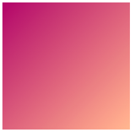
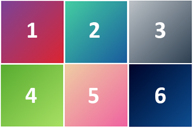
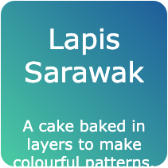
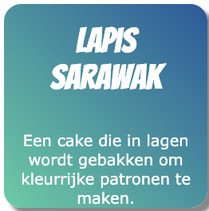

## Stijl je kaart

<div style="display: flex; flex-wrap: wrap">
<div style="flex-basis: 200px; flex-grow: 1; margin-right: 15px;">
In deze stap voegt je kleurverlopen en afgeronde hoeken toe aan jouw kaart. Je lijnt de tekst ook zo uit dat deze in het midden van de kaart verschijnt. 
</div>
<div>
<iframe src="https://editor.raspberrypi.org/en/embed/viewer/flip-treat-webcards-step-4" width="500" height="400" frameborder="0" marginwidth="0" marginheight="0" allowfullscreen> </iframe>
</div>
</div>

<p style="border-left: solid; border-width:10px; border-color: #0faeb0; background-color: aliceblue; padding: 10px;">
<span style="color: #0faeb0">**Kleurverlopen**</span> zijn een geleidelijke verandering van de ene kleur naar de andere. Om te bepalen hoe een vloeiend kleurverloop kan worden weergegeven, berekenen computers de posities en kleurschakeringen die nodig zijn om van de startkleur tot en met de eindkleur te gaan. 


</p>

Verlopen worden gebruikt om ervoor te zorgen dat jouw kaart de aandacht van de kijker trekt.

\--- task ---

Voeg de class `gradient1` toe aan de `<div>` die de afbeelding weergeeft.

De class `gradient1` gebruikt een lineair verloop dat diagonaal overgaat van de ene kleur bovenaan naar een andere kleur onderaan.



## --- code ---

language: html
filename: index.html
line_numbers: true
line_number_start: 28
line_highlights: 32
--------------------------------------------------------

```
<main>
    <section class="wrap">
      <div class="card">
        <div class="card-content">
          <div class="card-face gradient1">
            
          </div>
          <div class="card-face flipme">
            <h2>Lapis Sarawak</h2>
            <p>A cake baked in layers to make colourful patterns.</p>
          </div>
        </div>
      </div>
    </section> 
```

\--- /code ---

\--- /task ---

\--- task ---

Voeg de class `gradient2` toe aan de `<div>` die de kop en alinea weergeeft.

De class `gradient2` gebruikt een lineair verloop dat diagonaal overgaat van de ene kleur bovenaan naar een andere kleur rechtsonder.


## --- code ---

language: html
filename: index.html
line_numbers: true
line_number_start: 28
line_highlights: 35
--------------------------------------------------------

```
<main>
    <section class="wrap">
      <div class="card">
        <div class="card-content">
          <div class="card-face gradient1">
            
          </div>
          <div class="card-face flipme gradient2">
            <h2>Lapis Sarawak</h2>
            <p>A cake baked in layers to make colourful patterns.</p>
          </div>
        </div>
      </div>
    </section> 
```

\--- /code ---

\--- /task ---

\--- task ---

**Test:** Klik op de **Run** knop.

Beweeg de muis over (of tik) op de kaart op jouw webpagina om te zien of beide verlopen zijn toegevoegd.

<div>
<iframe src="https://editor.raspberrypi.org/en/embed/viewer/flip-treat-webcards-step-4a" width="500" height="400" frameborder="0" marginwidth="0" marginheight="0" allowfullscreen> </iframe>
</div>

\--- /task ---

\--- task ---

Klik op het `default.css` bestand en zoek het kleurenpalet bij de bovenkant van de pagina.

**Keuze:** Kleurverlopen gebruiken variabelen uit het kleurenpalet. Kies uit deze opties de verlopen die je het mooist vindt:



1. \#7b4397 → #dc2430
2. \#43cea2 → #185a9d
3. \#bdc3c7 → #2c3e50
4. \#56ab2f → #a8e063
5. \#eecda3 → #ef629f
6. \#000428 → #004e92

**Update** de variabelen om de voor- en achterkant van de kaart in je nieuwe verloop te zien:

- De voorkant van de kaart gebruikt `secondary` en `detail` variabelen
- De achterkant van de kaart gebruikt `tertiary` en `detail2` variabelen

**Tip:** Misschien moet je ook `onsecondary` en `ontertiary` kleuren veranderen zodat je tekst in de nieuwe kleuren kan worden gelezen.

## --- code ---

language: css
filename: default.css
line_numbers: true
line_number_start: 1
line_highlights: 5-6, 9-10, 12-13
----------------------------------------------------------------------

/\* Stel het kleurenpalet en lettertypen in met behulp van variabelen \*/

:root {
\--primary: #ffffff;
\--secondary: #aa076b;
\--tertiary: #43cea2;
\--page: #ffffff;
\--onprimary: #664300;
\--onsecondary: #664300;
\--ontertiary: #ffffff;
\--onpage: #000000;
\--detail: #ffb88c;
\--detail2: #185a9d;

\--- /code ---

\--- /task ---

\--- task ---

Klik opnieuw op het `style.css` bestand en zoek de `gradient1` en `gradient2` klassen.

**Keuze:** Werk het verloop bij in de richting die je het beste vindt. Probeer `top`, `right`, of `bottom left`.

## --- code ---

language: css
filename: style.css
line_numbers: true
line_number_start: 243
line_highlights: 245, 254
--------------------------------------------------------------

.gradient1 {
background-image: linear-gradient(
to bottom right,
var(--secondary),
var(--detail)
);
color: var(--onsecondary);
}

.gradient2 {
background-image: linear-gradient(
to bottom right,
var(--tertiary),
var(--detail2)
);
color: var(--ontertiary);
}

\--- /code ---

\--- /task ---

\--- task ---

Klik op 'index.html`. Voeg de klasse `rounded\` toe aan beide kanten van de card om afgeronde hoeken aan je card toe te voegen.

## --- code ---

language: html
filename: index.html
line_numbers: true
line_number_start: 28
line_highlights: 32, 35
------------------------------------------------------------

```
<main>
    <section class="wrap">
      <div class="card">
        <div class="card-content">
          <div class="card-face gradient1 rounded">
            
          </div>
          <div class="card-face flipme gradient2 rounded">
            <h2>Lapis Sarawak</h2>
            <p>A cake baked in layers to make colourful patterns.</p>
          </div>
        </div>
      </div>
    </section> 
```

\--- /code ---

\--- /task ---

\--- task ---

**Test:** Klik op de **Run** knop.

Beweeg de muis over (of tik) op de kaart op je webpagina om te controleren of beide zijden van de kaart afgeronde hoeken hebben.

<div>
<iframe src="https://editor.raspberrypi.org/en/embed/viewer/flip-treat-webcards-step-4b" width="500" height="400" frameborder="0" marginwidth="0" marginheight="0" allowfullscreen> </iframe>
</div>

\--- /task ---

\--- task ---

De tekst op de kaart is niet correct uitgelijnd.



Voeg de `ycenter` klasse toe om de tekst in het midden van de `y` as uit te lijnen.



## --- code ---

language: html
filename: index.html
line_numbers: true
line_number_start: 28
line_highlights: 35
--------------------------------------------------------

```
<main>
    <section class="wrap">
      <div class="card">
        <div class="card-content">
          <div class="card-face gradient1 rounded">
            
          </div>
          <div class="card-face flipme gradient2 rounded ycenter">
            <h2>Lapis Sarawak</h2>
            <p>A cake baked in layers to make colourful patterns.</p>
          </div>
        </div>
      </div>
    </section> 
```

\--- /code ---

\--- /task ---

\--- task ---

**Test:** Klik op de **Run** knop.

Beweeg de muis over (of tik) op de kaart op jouw webpagina om te controleren of de tekst op het tweede vlak in het midden van de 'y'-as is uitgelijnd.

<div>
<iframe src="https://editor.raspberrypi.org/en/embed/viewer/flip-treat-webcards-step-4c" width="500" height="400" frameborder="0" marginwidth="0" marginheight="0" allowfullscreen> </iframe>
</div>

\--- /task ---

\--- task ---

Gebruik de `schaduw` klasse om een schaduweffect toe te voegen aan beide kanten van je kaart.

## --- code ---

language: html
filename: index.html
line_numbers: true
line_number_start: 28
line_highlights: 32, 35
------------------------------------------------------------

```
<main>
    <section class="wrap">
      <div class="card">
        <div class="card-content">
          <div class="card-face gradient1 rounded shadow">
            
          </div>
          <div class="card-face flipme gradient2 rounded ycenter shadow">
            <h2>Lapis Sarawak</h2>
            <p>Een cake die in lagen is gebakken om kleurrijke patronen te maken.</p>
          </div>
        </div>
      </div>
    </section> 
```

\--- /code ---

\--- /task ---

\--- task ---

**Test:** Klik op de **Run** knop.

Beweeg de muis over (of tik) op de kaart op je webpagina om te controleren of de kaart nu een schaduweffect heeft.

<iframe src="https://editor.raspberrypi.org/en/embed/viewer/flip-treat-webcards-step-4" width="500" height="400" frameborder="0" marginwidth="0" marginheight="0" allowfullscreen> </iframe>

\--- /task ---


