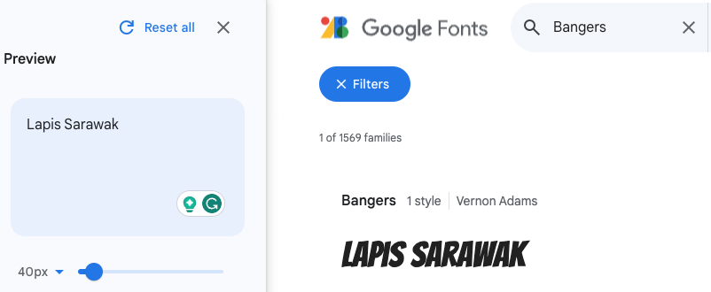

## Kies je lettertype

Hiervoor gebruik je de online lettertypebibliotheek van Google om een decoratief lettertype in je webpagina te importeren. 

<iframe src="https://editor.raspberrypi.org/en/embed/viewer/flip-treat-webcards-step-5" width="500" height="400" frameborder="0" marginwidth="0" marginheight="0" allowfullscreen> </iframe>

**Web designers** moet nadenken over hoe een website eruitziet en hoe deze het merk van het bedrijf weergeeft, het product of persoon waarvoor ze de website ontwerpen. Standaard web safe fonts worden aanbevolen voor het grootste deel van de tekst op een webpagina. Wanneer een ontwerper impact wil creëren, kan een unieker lettertype worden gebruikt. Ontwerpers kunnen **web fonts** importeren uit een online lettertypebibliotheek om ervoor te zorgen dat hun website de aandacht van mensen trekt.

[[[web-fonts]]]

Google heeft een gratis online lettertype bibliotheek met meer dan 1500 lettertypen om uit te kiezen. Op de site kunt je je eigen voorbeeldtekst gebruiken om door verschillende lettertypen te bladeren en je zo te helpen het juiste lettertype te vinden. Google geeft dan de **HTML** die je nodig hebt om het lettertype naar je website te **importeren**.

\--- task ---

Open [fonts.google.com](https://fonts.google.com/){:target="_blank"}. De link wordt geopend in een nieuw tabblad.

\--- /task ---

\--- task ---

Typ een voorbeeldtekst in het vak **Preview**. In het voorbeeld wordt de naam 'Lapis Sarawak' gebruikt.

**Let op** dat de voorbeelden je voorbeeldtekst tonen. Je kunt zien hoe je woorden er in alle beschikbare lettertypen uitzien.

\--- /task ---

Er zijn veel verschillende zoekfilters om te gebruiken. Je kunt zoeken op taal, of op verschillende lettertype-eigenschappen.

\--- task ---

Voer de lettertypenaam `Bangers` in het vak 'search fonts' in.

**Merk op** dat je nu een voorbeeld van het Bangers lettertype kunt zien dat is toegepast op de voorbeeldtekst.

\--- /task ---

\--- task ---

Klik op de Bangers-kaart die in de zoekresultaten is verschenen.

\--- /task ---

\--- task ---

Klik op de 'Select' link (ons voorbeeld toont 'Select Regular 400').

**Let op** dat er een venster inspringt vanuit de zijkant. Het venster geeft je de code die je nodig hebt.

\--- /task ---

\--- task ---

Klik op het kopieerpictogram om de HTML-code te kopiëren.

\--- /task ---

\--- task ---

Vouw de sectie `<head>` van `index.html` uit, als deze is samengevouwen.

Zoek de opmerking in je `index.html`-document met de tekst `<!-- Importeer lettertypen van Google --> `.

Plak de HTML-code die je zojuist hebt gekopieerd onder de opmerking.

## --- code ---

language: html
filename: index.html
line_numbers: true
line_number_start: 15
line_highlights: 16-18
-----------------------------------------------------------

  <!-- Import fonts from Google -->

  <link rel="preconnect" href="https://fonts.googleapis.com">
  <link rel="preconnect" href="https://fonts.gstatic.com" crossorigin>
  <link href="https://fonts.googleapis.com/css2?family=Bangers&display=swap" rel="stylesheet">

\--- /code ---

\--- /task ---

Je hebt nu de lettertypen die je nodig hebt geïmporteerd uit de Google Fonts-bibliotheek. Voeg vervolgens de juiste CSS toe zodat de webbrowser weet wanneer dit lettertype moet worden gebruikt.

\--- task ---

Ga naar je `default.css` bestand en zoek de `header-font` en `title-font` variabelen.

**Vervang** het huidige lettertype `Verdana` door `Bangers`.

## --- code ---

language: css
filename: default.css
line_numbers: true
line_number_start: 15
line_highlights: 16-17
-----------------------------------------------------------

\--body-font: 1.1rem Verdana, sans-serif;
\--header-font: lighter 3rem Bangers, cursive;
\--title-font: lighter 2rem Bangers, cursive;

\--- /code ---

\--- /task ---

\--- task ---

**Test:** Klik op de **Run** knop.

Beweeg de muis over (of tik) op jouw flipcard in het voorbeeldvenster. Je zou het nieuwe lettertype moeten zien toegepast op de kop van de achterkant van de kaart.

<iframe src="https://editor.raspberrypi.org/en/embed/viewer/flip-treat-webcards-step-5" width="500" height="400" frameborder="0" marginwidth="0" marginheight="0" allowfullscreen> </iframe>

\--- /task ---

\--- task ---

**Keuze:** Om je eigen lettertype te kiezen, ga terug naar [fonts.google.com](https://fonts.google.com/){:target="_blank"}.

**Verwijder** de Bangers stijl in Google Fonts voordat je je nieuwe lettertype selecteert.

**Tip** Vergeet niet om je `default.css` bestand bij te werken om de nieuwe lettertype naam toe te voegen.

\--- /task ---

\--- collapse ---

---

## title: Voltooid project

Je kunt [het voltooide project hier](https://editor.raspberrypi.org/en/projects/flip-treat-webcards-step-5){:target="_blank"} bekijken.

\--- /collapse ---
