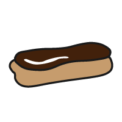

## Verbeter je project

Als je tijd hebt, kun je meer kaarten aan jouw project toevoegen, de animatie en kleuren aanpassen of een kop- en voettekst toevoegen.

### Meer kaarten toevoegen

<iframe src="https://editor.raspberrypi.org/en/embed/viewer/flip-treat-webcards-step-7" width="550" height="710" frameborder="0" marginwidth="0" marginheight="0" allowfullscreen> </iframe>

\--- task ---

Om nog een kaart toe te voegen, kopieer de onderstaande kaartcode en plak deze in 'index.html' onder je eerste kaart:

## --- code ---

language: html
filename: index.html
----------------------------------------------------

```
<section class="wrap">
    <div class="card">
      <div class="card-content">
        <div class="card-face gradient1 rounded">
          
        </div>
        <div class="card-face flipme gradient2 rounded ycenter">
          <h2>TreatName</h2>
          <p>TreatDescription</p>
        </div>
      </div>
    </div>
</section>
```

\--- /code ---

Vervang `AfbeeldingNaam`, `LekkernijNaam` en `LekkernijBeschrijving`, met je gekozen lekkernijen uit de onderstaande lijst.

**Opmerking:** Vergeet niet om de alternatieve tekst voor elke afbeelding bij te werken.

\--- collapse ---

---

## title: Bara Brith


**AfbeeldingNaam:** BaraBrith.png
**LekkernijNaam:** Bara Brith
**LekkernijBeschrijving** Een brood met gedroogd fruit en specerijen. Bara Brith wordt op smaak gebracht met thee.

\--- /collapse ---

\--- collapse ---

---

## title: Breskvice


**AfbeeldingNaam:** Breskvice01.png of Breskvice02.png
**LekkernijNaam:** Breskvice
**LekkernijBeschrijving:** Perzikvormige lekkernijen waarvan de ene helft rood gekleurd is en de andere helft geel gekleurd.

\--- /collapse ---

\--- collapse ---

---

## title: Brigadeiro


**Afbeeldingnaam:** Brigadeiro.png
**LekkernijNaam:** Brigadeiro
**LekkernijBeschrijving:** Een zoete, kleverige traktatie van chocolade die vaak wordt geserveerd in een klein papieren bekertje.

\--- /collapse ---

\--- collapse ---

---

## title: Dango


**AfbeeldingNaam:** Dango01.png of Dango02.png
**LekkernijNaam:** Dango
**LekkernijBeschrijving:** Een dumpling gemaakt van rijstmeel en geserveerd aan een spiesje.

\--- /collapse ---

\--- collapse ---

---

## title: DatePalm


**AfbeeldingNaam:** DatePalm01.png of DatePalm02.png
**LekkernijNaam:** Date Palm
**LekkernijBeschrijving:** Fruit van de dadelpalm, deze zoete lekkernijen kunnen vers of gedroogd worden gegeten.

\--- /collapse ---

\--- collapse ---

---

## title: Eclair



**AfbeeldingNaam:** Eclair.png
**LekkernijNaam:** Eclair
**LekkernijBeschrijving:** Soesjesdeeg gevuld met room en overdekt met glazuur met een smaakje.

\--- /collapse ---

\--- collapse ---

---

## title: Fairy Bread


**AfbeeldingNaam:** FairyBread.png
**LekkernijNaam:** Fairy Bread
**LekkernijBeschrijving:** Een leuke, kleurrijke traktatie gemaakt van witbrood, boter en hagelslag.

\--- /collapse ---

\--- collapse ---

---

## title: French Fancy


**AfbeeldingNaam:** FrenchFancy.png
**LekkernijNaam:** French Fancy
**LekkernijBeschrijving:** Een biscuitgebak met een vanille-topping en geheel bedekt met gekleurd glazuur.

\--- /collapse ---

\--- collapse ---

---

## title: Halva


**AfbeeldingNaam:** Halva.png
**LekkernijNaam:** Halva
**LekkernijBeschrijving:** Halva's populariteit over de hele wereld heeft geleid tot veel variaties op deze traktatie die is gezoet met suiker en honing.

\--- /collapse ---

\--- collapse ---

---

## title: Jalebi


**AfbeeldingNaam:** Jalebi.png
**LekkernijNaam:** Jalebi
**LekkernijBeschrijving:** Gefrituurde zoete snacks in pretzel- of ronde vormen.

\--- /collapse ---

\--- collapse ---

---

## title: Knafeh


**AfbeeldingNaam:** Knafeh.png
**LekkernijNaam:** Knafeh
**LekkernijBeschrijving:** Een dessertgebak gemaakt van in siroop gedrenkt deeg met een kaasvulling.

\--- /collapse ---

\--- collapse ---

---

## title: Ladoo


**AfbeeldingNaam:** Ladoo.png
**LekkernijNaam:** Ladoo
**LekkernijBeschrijving:** Ronde gefrituurde balletjes gemaakt van bloem, boter en suiker.

\--- /collapse ---

\--- collapse ---

---

## title: Lolly Cake


**AfbeeldingNaam:** LollyCake.png
**LekkernijNaam:** Lolly Cake
**LekkernijBeschrijving:** Een blokcake die gevuld is met lollies of snoep, in kokosnoot gerold en vervolgens in plakjes gesneden.

\--- /collapse ---

\--- collapse ---

---

## title: Maejakgwa


**AfbeeldingNaam:** Maejakgwa01.png of Maejakgwa02.png
**LekkernijNaam:** Maejakgwa
**LekkernijBeschrijving:** Gefrituurde zoete gemberkoekjes bedekt met siroop.

\--- /collapse ---

\--- collapse ---

---

## title: Mandazi


**AfbeeldingNaam:** Mandazi.png
**LekkernijNaam:** Mandazi
**LekkernijBeschrijving:** Mandazi is een gefrituurde donut van brood in de vorm van een driehoek of rechthoek.

\--- /collapse ---

\--- collapse ---

---

## title: Esdoorn Blad Koekje


**AfbeeldingNaam:** MapleLeafBiscuit.png
**LekkernijNaam:** Maple Leaf Biscuit
**LekkernijBeschrijving:** Twee koekjes op elkaar geplakt met een vulling gemaakt van een crème van ahornsiroop.

\--- /collapse ---

\--- collapse ---

---

## title: Oliebollen


**AfbeeldingNaam:** Oliebollen.png
**AfbeeldingBeschrijving:** Oliebollen
**LekkernijBeschrijving:** Gefrituurd deeg dat is gemengd met fruit en tot balletjes is gevormd.

\--- /collapse ---

\--- collapse ---

---

## title: Party Ring


**AfbeeldingNaam:** PartyRing.png
**LekkernijNaam:** Party Ring
**LekkernijBeschrijving:** Een soort koekje met een harde laag gekleurd glazuur aan de bovenkant.

\--- /collapse ---

\--- collapse ---

---

## title: Tim Tams


**AfbeeldingNaam:** TimTams.png
**LekkernijNaam:** Tim Tams
**LekkernijBeschrijving:** Een chocoladekoekje met een vulling van chocoladecrème en een omhulsel van harde chocolade.

\--- /collapse ---

\--- collapse ---

---

## title: Zarda


**AfbeeldingNaam:** Zarda.png
**LekkernijNaam:** Zarda
**LekkernijBeschrijving:** Een geurig, geel zoete-rijstdessert dat vaak wordt gebakken met gedroogd fruit of noten.

\--- /collapse ---

<iframe src="https://editor.raspberrypi.org/en/embed/viewer/flip-treat-webcards-step-7" width="550" height="710" frameborder="0" marginwidth="0" marginheight="0" allowfullscreen> </iframe>

\--- /task ---

### Bouw je webpagina

\--- task ---

Gebruik je vaardigheden uit het project [Anime uitdrukkingen](http://rpf.io/anime-expressions){:target="_blank"} en [Top 5 emoji's](http://rpf.io/top-5- emoji-list){:target="_blank"} project om het volgende toe te voegen:

- Een koptekst
- Een voettekst
- Een citaat

\--- /task ---

\--- collapse ---

---

## title: Verbeterd project

Je kunt het [geüpgradede project hier](https://editor.raspberrypi.org/en/projects/flip-treat-webcards-step-7){:target="_blank"} bekijken.

\--- /collapse ---

\--- save ---
